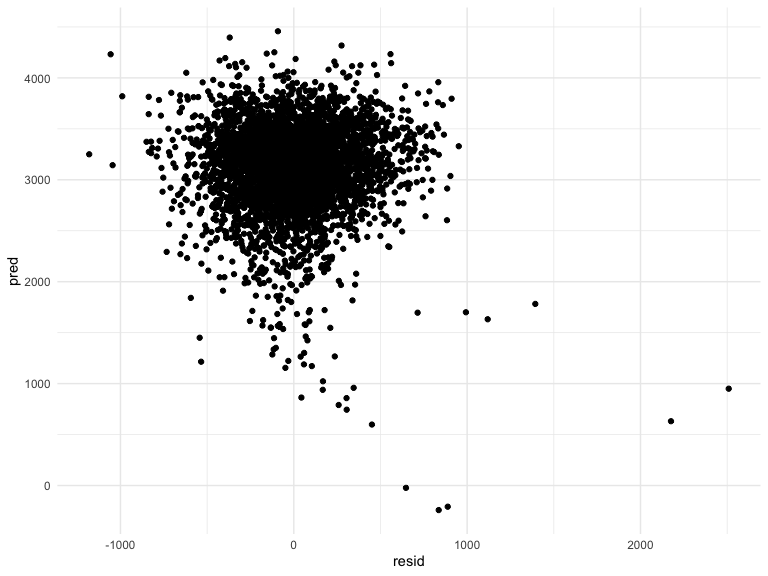
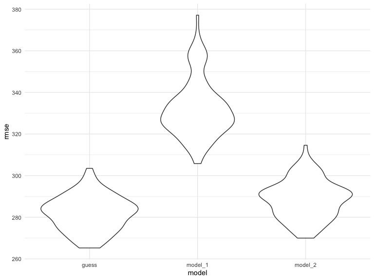
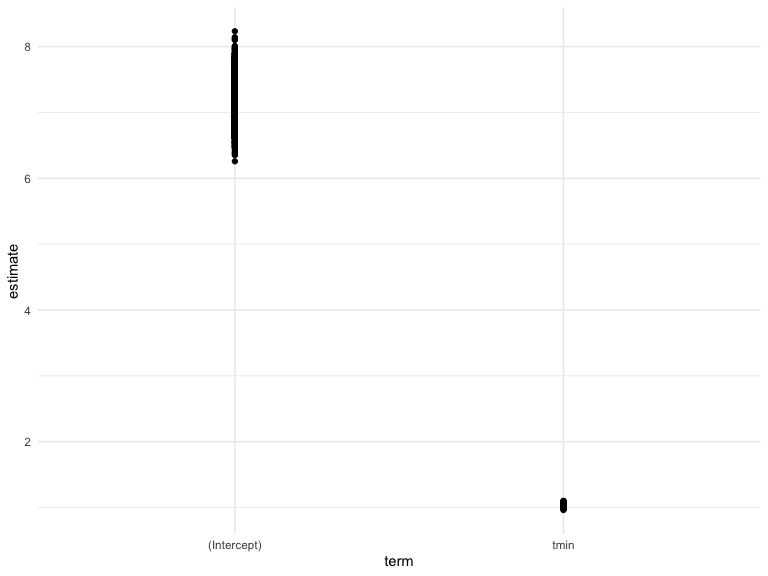

p8105\_HW6\_rt2640
================
Riddhi Thakkar
12/06/2021

``` r
library(tidyverse)
```

    ## ── Attaching packages ─────────────────────────────────────── tidyverse 1.3.1 ──

    ## ✓ ggplot2 3.3.5     ✓ purrr   0.3.4
    ## ✓ tibble  3.1.4     ✓ dplyr   1.0.7
    ## ✓ tidyr   1.1.3     ✓ stringr 1.4.0
    ## ✓ readr   2.0.1     ✓ forcats 0.5.1

    ## ── Conflicts ────────────────────────────────────────── tidyverse_conflicts() ──
    ## x dplyr::filter() masks stats::filter()
    ## x dplyr::lag()    masks stats::lag()

``` r
library(modelr)
library(mgcv)
```

    ## Loading required package: nlme

    ## 
    ## Attaching package: 'nlme'

    ## The following object is masked from 'package:dplyr':
    ## 
    ##     collapse

    ## This is mgcv 1.8-38. For overview type 'help("mgcv-package")'.

``` r
knitr::opts_chunk$set(
    echo = TRUE,
    warning = FALSE,
    fig.width = 8, 
  fig.height = 6,
  out.width = "90%"
)
options(
  ggplot2.continuous.colour = "viridis",
  ggplot2.continuous.fill = "viridis"
)
scale_colour_discrete = scale_colour_viridis_d
scale_fill_discrete = scale_fill_viridis_d
theme_set(theme_minimal() + theme(legend.position = "bottom"))
set.seed(1)
```

### Question 1

``` r
birthweight = read_csv("./data/birthweight.csv")
```

    ## Rows: 4342 Columns: 20

    ## ── Column specification ────────────────────────────────────────────────────────
    ## Delimiter: ","
    ## dbl (20): babysex, bhead, blength, bwt, delwt, fincome, frace, gaweeks, malf...

    ## 
    ## ℹ Use `spec()` to retrieve the full column specification for this data.
    ## ℹ Specify the column types or set `show_col_types = FALSE` to quiet this message.

``` r
bw_mod = birthweight %>% 
  mutate(
    babysex = case_when(
      babysex == 1 ~"male",
      babysex == 2 ~"female"),
    frace = case_when(
      frace == 1 ~"white",
      frace == 2 ~"black",
      frace == 3 ~"asian",
      frace == 4 ~"puerto_rican",
      frace == 8 ~"other",
      frace == 9 ~"unknown"),
    mrace = case_when(
      mrace == 1 ~"white",
      mrace == 2 ~"black",
      mrace == 3 ~"asian",
      mrace == 4 ~"puerto_rican",
      mrace == 8 ~"other"),
    malform = case_when(
      malform == 0 ~"absent",
      malform == 1 ~"present")
    )
```

``` r
bw_guess1 = lm(bwt ~ ., data = bw_mod) %>% 
  broom::tidy()
bw_guess2 = lm(
  bwt ~ babysex + bhead + blength + delwt +gaweeks + parity + smoken, 
  data = bw_mod)
```

``` r
guess = bw_mod %>% 
  modelr::add_residuals(bw_guess2) %>%  
  modelr::add_predictions(bw_guess2)
guess %>% 
ggplot(aes(x = resid,y=pred))+
  geom_point()
```



We first fitted a linear model using all the possible predictors and
then did a shortened version of backward elimination just to get a
prelim model to work with.

``` r
model_1 = lm(bwt ~ blength + gaweeks, data = bw_mod)
model_2 = lm(bwt ~ bhead*blength*babysex, data = bw_mod)
```

``` r
cv_df =
  crossv_mc(bw_mod, 100) %>% 
  mutate(
    train = map(train, as_tibble),
    test = map(test, as_tibble))
#Next I’ll use mutate + map & map2 to fit models to training data and obtain corresponding RMSEs for the testing data.
cv_df = 
  cv_df %>% 
  mutate(
    guess_mod  = 
      map(train, ~lm(bwt ~ babysex + bhead + blength + delwt +gaweeks + parity + smoken, 
                     data = .x)),
    model_1  = 
      map(train, ~lm(bwt ~ blength + gaweeks, 
                     data = .x)),
    model_2  = 
      map(train, ~lm(bwt ~ bhead*blength*babysex, 
                     data = as_tibble(.x)))) %>% 
  mutate(rmse_guess = map2_dbl(guess_mod, test, ~rmse(model = .x, data = .y)),
         rmse_model_1    = map2_dbl(model_1, test, ~rmse(model = .x, data = .y)),
         rmse_model_2 = map2_dbl(model_2, test, ~rmse(model = .x, data = .y)))
rmse_data = cv_df %>% 
  select(starts_with("rmse")) %>% 
pivot_longer(
    everything(),
    names_to = "model", 
    values_to = "rmse",
    names_prefix = "rmse_") %>% 
  mutate(model = fct_inorder(model))
rmse_data %>% 
  ggplot(aes(x = model, y = rmse)) + geom_violin()
```



Model 1 is a model using length at birth and gestational age as main
effects predictors and model 2 is a model using head circumference,
length, sex and all their internal interactions. Guess is the model
using a very truncated verison of backward elimination.

## Problem 2

``` r
weather_df = 
  rnoaa::meteo_pull_monitors(
    c("USW00094728"),
    var = c("PRCP", "TMIN", "TMAX"), 
    date_min = "2017-01-01",
    date_max = "2017-12-31") %>%
  mutate(
    name = recode(id, USW00094728 = "CentralPark_NY"),
    tmin = tmin / 10,
    tmax = tmax / 10) %>%
  select(name, id, everything())
```

    ## Registered S3 method overwritten by 'hoardr':
    ##   method           from
    ##   print.cache_info httr

    ## using cached file: ~/Library/Caches/R/noaa_ghcnd/USW00094728.dly

    ## date created (size, mb): 2021-10-05 10:29:30 (7.602)

    ## file min/max dates: 1869-01-01 / 2021-10-31

``` r
weather_boot = weather_df %>% 
  modelr::bootstrap(n = 5000) %>% 
  mutate(
    models = map(strap, ~lm(tmax ~ tmin, data = .x) ),
    results = map(models, broom::tidy)) %>% 
  select(-strap, -models) %>% 
  unnest(results)
weather_boot %>% 
  ggplot(aes(x=term,y=estimate))+
  geom_point()
```



The estimates for *β̂*<sub>1</sub> is rather consistent around 1 but the
estimates for *β̂*<sub>0</sub> deviates between 6-8

``` r
weather_boot_base = weather_df %>% 
  modelr::bootstrap(n = 5000) %>% 
  mutate(
    models = map(strap, ~lm(tmax ~ tmin, data = .x) ))
weather_boot_tidy = weather_boot_base %>% 
  mutate(
    results = map(models, broom::tidy)
  ) %>% 
  select(-strap, -models) %>% 
  unnest(results) %>% 
  select(.id,term,estimate) %>% 
  pivot_wider(
    .id:estimate,
    names_from = "term",
    values_from = "estimate"
  )
  
weather_boot_glance = weather_boot_base %>% 
  mutate(
    results_2 = map(models, broom::glance)
  ) %>% 
  select(-strap, -models) %>% 
  unnest(results_2) %>% 
  select(.id,adj.r.squared)
boot_joined = left_join(weather_boot_tidy,weather_boot_glance, by = ".id") %>% 
  janitor::clean_names() %>% 
  mutate(
    log_b0b1 = log(intercept*tmin)
  )
  
boot_sum1 = boot_joined %>%  
  summarize(
    log_b0b1 = mean(log_b0b1),
    adj_r_squared = mean(adj_r_squared)
  )
boot_sum2 = boot_joined %>% 
  summarize(
    std_log_b0b1 = sd(log_b0b1),
    std_adj_r_squared = sd(adj_r_squared)
  )
```

The 95% confidence interval for
*L**o**g*(*B*<sub>0</sub> \* *B*<sub>1</sub>) is (2.0124337,2.0137379)
and the 95% confidence interval for *r*<sup>2</sup> is
(0.9108164,0.9112931)
